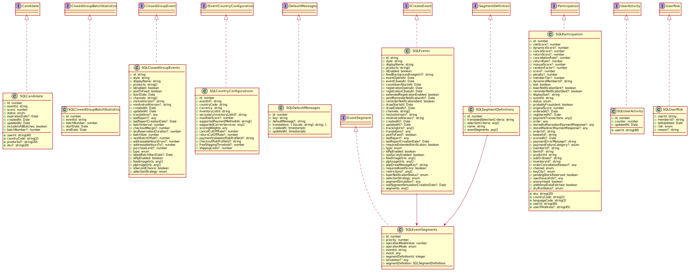

# uni-sso

> SSO, once and for all

[](https://travis-ci.com/Jeff-Tian/uni-sso)

## Deployments

This project's Travis CI will deploy it to 3 PaaS platforms. To make it deploy to KubeSail and Okteto successfully
, you need to base64 encrypt the kubernetes config file and save it as an environment variable in Travis CI:

- Windows

```dos
certutil.exe -encodehex ..\k8s-config\okteto\config .\okteto\config 1 && type .\okteto\config | clip.exe
```

- macOS

```shell
cat ~/k8s-config/kubesail/config | base64 | pbcopy
```

### Heroku

https://uni-sso.herokuapp.com/

This is done by travis

### KubeSail

https://sso.jiwai.win

This can be done through `npm run deploy` for the first time and `npm run update` afterwards.

You need to be have already configured and switched to your kubesail context before you run `npm run deploy` or `npm run update`, for example using `k8ss`:

```shell
k8ss switch --cluster=kubesail --namespace=jeff-tian
```

### Okteto

https://uni-sso-jeff-tian.cloud.okteto.net/

## Installation

```bash
$ npm install
```

## Running the app

```bash
# development
$ npm run start

# watch mode
$ npm run start:dev

# production mode
$ npm run start:prod
```

## Test

```bash
# unit tests
$ npm run test

# e2e tests
$ npm run test:e2e

# test coverage
$ npm run test:cov
```

## Models


