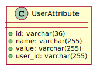

# uni-sso

> SSO, once and for all

[](https://assertible.com/dashboard#/services/ed5330e3-148c-41c1-b76c-c5d6046227a0/results)

## API Documentation

- **Swagger Hub**: https://sso.jiwai.win/api

## Deployments

This project's Travis CI will deploy it to 2 PaaS platforms. To make it deploy to Okteto successfully
, you need to base64 encrypt the kubernetes config file and save it as an environment variable in Travis CI:

- Windows

```dos
certutil.exe -encodehex ..\k8s-config\okteto\config .\okteto\config 1 && type .\okteto\config | clip.exe
```

- macOS

```shell
cat ~/k8s-config/kubesail/config | base64 | pbcopy
```

But now my travis CI is stopped. So now only the heroku deployment is working.

### Heroku

- https://uni-sso.herokuapp.com/
- https://sso.jiwai.win

### Okteto (Stopped)

https://uni-sso-jeff-tian.cloud.okteto.net/

## Secrets

Secrets maintained in a separate private project: https://github.com/Jeff-Tian/uni-sso-secrets

It's mainly a `secrets.yml` that can be applied to kubernetes cluster. In heroku, they are just configurable
environment variables.

## Logging

Log streamed to elastic search

### Local

- https://gimli-eu-west-1.searchly.com

### Production

- https://uniheart-2072617778.ap-southeast-2.bonsaisearch.net
- Dashboard: https://app.bonsai.io/login

#### Kibana

- https://uniheart-2072617778.k4a.bonsaisearch.net/app/kibana#/discover
- https://uni-sso-kibana.herokuapp.com/

## Monitoring

- Grafana: https://jefftian.grafana.net/d/_79iEbWMz/uni-sso-registered-users?orgId=1

- Swagger stats: https://sso.jiwai.win/swagger-stats/ux#/

## Analysis

- Metabase: https://metalock.herokuapp.com/dashboard/1

## Clients

- https://uni-sso.onrender.com (Direct, or uni-sso's pure front-end)
- https://sso.pa-ca.me/ (Direct, or uni-sso's pure front-end)
- https://pa-ca.me (Indirect, will redirect to https://sso.pa-ca.me to redirect back)

## Installation

```bash
$ npm install
```

## Running the app

```bash
# development
$ npm run start

# watch mode
$ npm run start:dev

# production mode
$ npm run start:prod
```

## Test

```bash
# unit tests
$ npm run test

# e2e tests
$ npm run test:e2e

# test coverage
$ npm run test:cov
```

## Entities



## TODO

- Switch to fastify (Already deployed to okteto, without something not working due to passport not supported by fastify), challenges:
    - auth (don't use passport)
